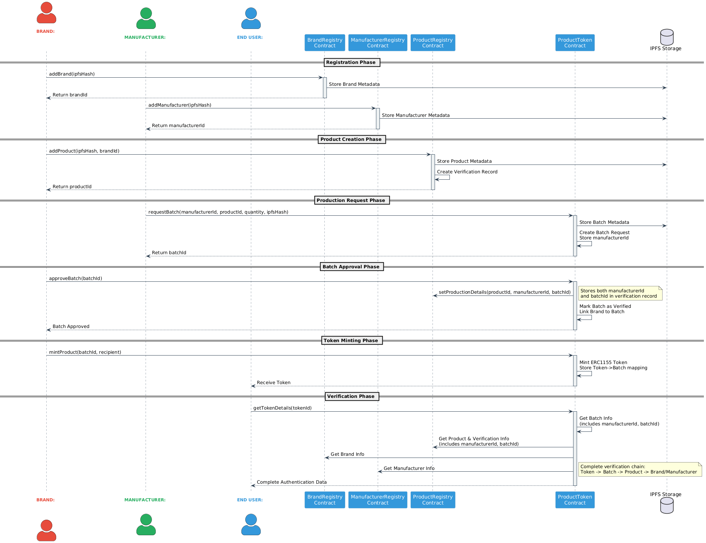

# Product Authentication System

A decentralized product authentication system built on Polygon blockchain that enables brands and manufacturers to create, verify, and track authentic products using NFTs.

## 🌐 Why Polygon?

This system is specifically built for the Polygon network, offering several advantages:
- **Low Transaction Costs**: Significantly reduced gas fees compared to Ethereum mainnet
- **High Speed**: Fast block confirmation times (~2 seconds)
- **Ethereum Compatibility**: Full EVM compatibility while maintaining scalability
- **Enterprise Ready**: Suitable for high-volume product authentication
- **Green Blockchain**: Energy-efficient Proof of Stake consensus
- **Network Stability**: High uptime and robust infrastructure

## 🔧 Tech Stack

- **Smart Contract Development**
  - Solidity ^0.8.26
  - Hardhat for compilation and testing
  - OpenZeppelin contracts

- **Deployment & Interaction**
  - Ethers.js v6
  - TypeScript

- **Frontend**
  - Next.js
  - React
  - TailwindCSS
  - Web3 wallet integration

- **Storage**
  - IPFS via Web3.Storage (Storacha)
  - Decentralized metadata storage
  - Product images and details
  - Immutable content addressing

## ⚠️ Frontend Notice
The current frontend implementation interfaces with the deprecated `ProductValidation.sol` contract. A new frontend implementation that works with the Registry system is under development.

## 🏗️ Contract Architecture

The system consists of four main smart contracts that work together to provide a complete product authentication solution:

### Registry Contracts

1. **BrandRegistry.sol**
   - Manages brand registration and ownership
   - Stores brand metadata on IPFS
   - Enables brand ownership transfer
   - Provides brand verification endpoints

2. **ManufacturerRegistry.sol**
   - Handles manufacturer registration
   - Stores manufacturer credentials and metadata
   - Manages manufacturer verification
   - Supports ownership transfer

3. **ProductRegistry.sol**
   - Creates and tracks authentic products
   - Links products to their respective brands
   - Maintains product verification records
   - Stores product metadata and specifications

4. **ProductToken.sol**
   - Implements ERC1155 token standard
   - Manages batch production requests
   - Handles token minting and distribution
   - Provides complete verification chain

## 🔄 System Flow

The system implements a secure flow for product authentication:



## 🚀 Deployment

### Prerequisites
```bash
npm install
```

### Available Scripts

```json
{
  "scripts": {
    "test-connection:mainnet": "tsx scripts/test-connection.ts",
    "test-connection:amoy": "tsx scripts/test-connection.ts --testnet",
    "deploy:mainnet": "tsx scripts/ethers-deploy.ts",
    "deploy:amoy": "tsx scripts/ethers-deploy.ts --testnet",
    "compile": "npx hardhat compile"
  }
}
```

### Command Descriptions

- **Compilation**
  - `npm run compile`: Compiles all Solidity contracts using Hardhat
    - Generates contract artifacts in `artifacts/` directory
    - Creates TypeScript typings for contracts

- **Connection Testing**
  - `npm run test-connection:mainnet`: Tests connection to Ethereum mainnet
    - Verifies RPC endpoint connectivity
    - Checks wallet configuration
    - Validates network status
  
  - `npm run test-connection:amoy`: Tests connection to Amoy testnet
    - Same checks as mainnet but for testnet
    - Ensures testnet RPC is accessible
    - Verifies testnet wallet setup

- **Deployment**
  - `npm run deploy:mainnet`: Deploys contracts to Ethereum mainnet
    - Uses ethers v6 for deployment
    - Requires proper environment variables
    - Handles contract constructor arguments
    
  - `npm run deploy:amoy`: Deploys contracts to Amoy testnet
    - Same functionality as mainnet deployment
    - Uses testnet configuration
    - Lower gas costs for testing

### Deployment Process

1. **Test Network Connection**
```bash
# For mainnet
npm run test-connection:mainnet

# For Amoy testnet
npm run test-connection:amoy
```

2. **Compile Contracts**
```bash
npm run compile
```

3. **Deploy Contracts**
```bash
# For mainnet
npm run deploy:mainnet BrandRegistry
npm run deploy:mainnet ManufacturerRegistry
npm run deploy:mainnet <brandRegistryAddress> ProductRegistry 
npm run deploy:mainnet <productRegistryAddress> <brandRegistryAddress> <manufacturerRegistryAddress> ProductToken 

# For Amoy testnet
npm run deploy:amoy BrandRegistry
npm run deploy:amoy ManufacturerRegistry
npm run deploy:amoy <brandRegistryAddress> ProductRegistry 
npm run deploy:amoy <productRegistryAddress> <brandRegistryAddress> <manufacturerRegistryAddress> ProductToken
```

### Environment Setup

Required environment variables:
```env
POLYGON_MAINNET_WS_URL=    # Mainnet WS RPC URL
POLYGON_TESTNET_URL=    # Amoy testnet RPC URL
NEXT_PUBLIC_WEB3_STORAGE_TOKEN=    # Web3 Storage API token (Storacha)
NEXT_PUBLIC_NETWORK=    # 'mainnet' or 'testnet'
PRIVATE_KEY=           # Deployment wallet private key
```

## 🔑 Key Features

- **Decentralized Authentication**: Leverages blockchain for immutable product records
- **Multi-Party Verification**: Involves both brands and manufacturers in the authentication process
- **Batch Production**: Supports bulk manufacturing with batch tracking
- **Token-Based Ownership**: Uses ERC1155 tokens for product ownership representation
- **Complete Verification Chain**: Maintains full product history from creation to current ownership
- **Decentralized Storage**: Uses IPFS for permanent, content-addressed storage of:
  - Product metadata and specifications
  - Brand and manufacturer information
  - Product images and documentation
  - Batch production details

## 💡 Use Cases

1. **Luxury Goods Authentication**
   - Verify authentic products
   - Track ownership history
   - Prevent counterfeiting

2. **Supply Chain Tracking**
   - Monitor manufacturing process
   - Track batch production
   - Verify authorized manufacturers

3. **Digital Ownership**
   - Transfer product ownership
   - Maintain product history
   - Verify product authenticity

## 🛠️ Technical Implementation

### Smart Contract Integration
- Brands register and create products
- Manufacturers request production rights
- Brands approve production batches
- Tokens minted for verified products
- End users can verify authenticity

### Storage
- Contract data stored on blockchain
- Metadata stored on IPFS
- Complete verification records maintained

### Security
- Role-based access control
- Ownership verification
- Multi-step authentication process
- Immutable record keeping

## 📝 License

MIT License - see LICENSE file for details
